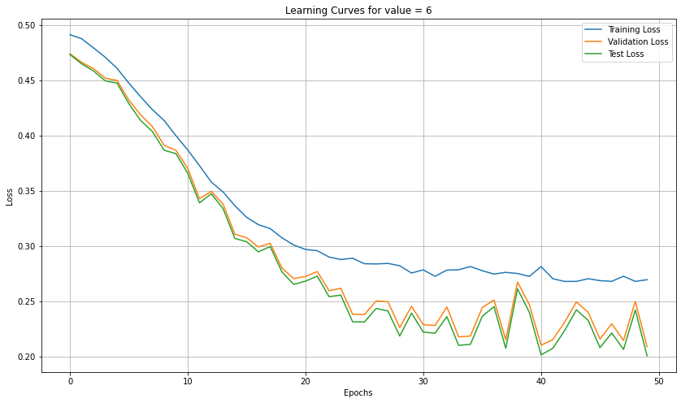

# 🧠 From-Scratch MLP & CNN Classifiers: Binary & Multi-Class Image Learning

This project implements two neural network pipelines:  
1. A **Multi-Layer Perceptron (MLP)** from scratch (no ML libraries) for binary classification.  
2. A **Convolutional Neural Network (CNN)** using Keras for CIFAR-10 image classification.

Designed for mastery of both low-level neural net mechanics and deep learning frameworks — aimed at real-world image classification problems and academic rigor.

---

## 📌 Overview

### 🔷 Task 1: MLP from Scratch (Binary Classification)

- Built a 2–nH–1 MLP with variable hidden units (nH = 2, 4, 6, 8, 10)
- Used custom SELU activation, MSE loss, and momentum-based SGD with regularization
- Trained on 1500 samples/class from `.mat` files; validated on 500/class
- Implemented early stopping based on validation loss plateau
- Output: learning curves + test accuracy for each nH

📈 Sample Learning Curve (nH = 6):  


### 🔷 Task 2: Deep CNN with Keras (CIFAR-10)

- Trained a CNN on 32×32×3 RGB images across 10 classes
- Used multiple convolution-ReLU-BatchNorm blocks + max pooling + dropout
- Final layer: fully connected with softmax over 10 outputs
- Experimented with:
  - Learning rates (0.05, 0.0001)
  - Batch sizes (16, 256)
  - Kernel size variation (3×3 → 7×7)
  - Impact of removing BatchNorm

📊 Final model achieved test accuracy >**81.09%**  

---

## 🗃️ Dataset Summary

| Task | Dataset | Format | Classes | Samples |
|------|---------|--------|---------|---------|
| Task 1 | `train_class0.mat`, `train_class1.mat`, `test_class0.mat`, `test_class1.mat` | 2D vectors | T-shirt vs Sneaker | 6000 train + 2000 test |
| Task 2 | CIFAR-10 via `keras.datasets` | 32×32×3 RGB images | 10 | 60,000 |

---

## 🚀 How to Run

### 🧪 Task 1: MLP from Scratch

```bash
# Run the custom MLP pipeline
python Part1.py
```

> 📍 Requires: `numpy`, `matplotlib`, `scipy.io`

### 🤖 Task 2: Deep CNN

```bash
# Open and run all cells in:
Part2.ipynb
```

> 📍 Requires: `tensorflow`, `keras`, `matplotlib`, `numpy`

---

## 📊 Key Outputs

- ✅ Training, validation, and test loss curves for each nH
- ✅ Accuracy comparison across MLP configurations
- ✅ CNN training accuracy, test accuracy, and hyperparameter impact analysis

---

## 🧠 Key Skills Demonstrated

- 🔧 **Neural Network Implementation from Scratch** (forward/backward propagation, MSE, momentum, regularization)
- 📊 **Learning Curve Analysis** & early stopping
- 🧪 **Hyperparameter Tuning & Optimization**
- 🖼️ **Image Classification with CNNs** (Keras, CIFAR-10)
- 💡 **Model Evaluation & Visualization**
